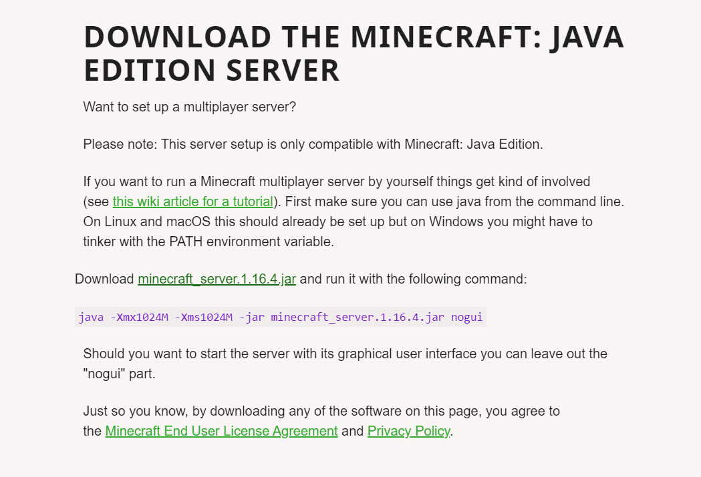

# how-to-host-a-free-24-7-minecraft-server
<h3>download the jar file at https://www.minecraft.net/en-us/download/server</h3>

after you have the jar file downloaded, create your server folder and place the jar file in, create a new text file inside of the file and then double click/run the jar file, it will then create a eula text file which you then have to turn eula=false to eula=true, then you can finish it off by port forwarding your server oout if you want your friends to join too!

<h3>how do you port forward?</h3>

well first you enter your routers ip into any search engine, log into your provider site and go to port forwarding, create a rule called minecraft server, enter your local ip (you can find it in the cmd with the command ipconfig) on the next bar, make sure the rule is UTC/UTP) save it and you can play on your server with your friends!(the server ip will now be your public ip which you can find by searching what is my ip on google).

